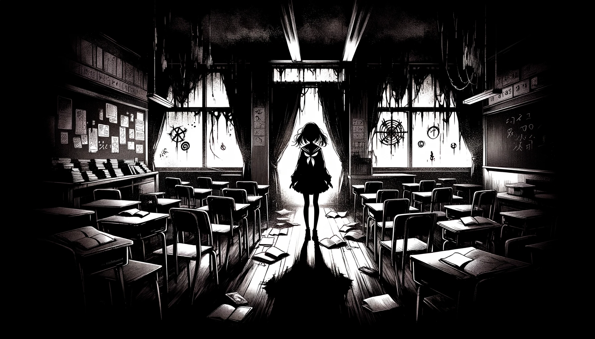

# Teichopsia

In a jarring shift from the mundane, the protagonist, a young high school student, wakes up in an unfamiliar, dark space, with no recollection of how she got there or what happened prior. Instead of the comforting rituals of school and friendship, she's faced with an environment that's both eerie and inexplicable. Despite the darkness, tiny elements in her surroundings start to exhibit strange distortions. A shimmering light in the distance that keeps changing position, the echo of footsteps where there should be none, and the unsettling feeling that time itself is fractured.

At first, these oddities might seem inconsequential, but as they accumulate, so do the protagonist's mysterious migraines and fleeting visual disturbances—manifestations of teichopsia.

Your role in this unsettling scenario is to guide the young student through this enigmatic world. Though your decisions may seem inconsequential at first glance, they have the power to subtly alter the very fabric of her reality. But proceed with caution. As the protagonist becomes increasingly aware of the irregularities around her, she starts to question not just her surroundings but also the existence of an external influence: You.
